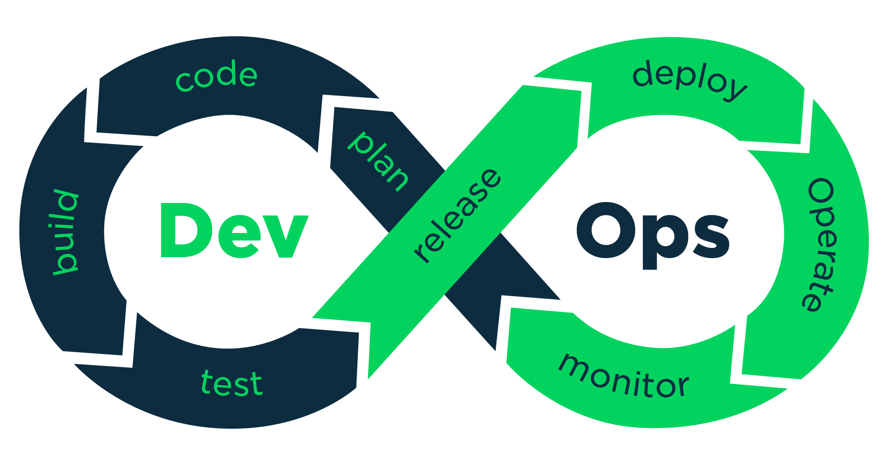

# DevOps-Roadmap

 

## Вступление
📌 DevOps методология автоматизации технологических процессов сборки, настройки и развёртывания программного обеспечения. Методология предполагает активное взаимодействие специалистов по разработке со специалистами по информационно-технологическому обслуживанию и взаимную интеграцию их технологических процессов друг в друга для обеспечения высокого качества программного продукта. Предназначена для эффективной организации создания и обновления программных продуктов и услуг. Основана на идее тесной взаимозависимости создания продукта и эксплуатации программного обеспечения, которая прививается команде как культура создания продукта.

### Оглавление

- [Programming language](#programing-language)
  - [Python](#Python)
  - [Golang](#Golang)
- [Step 0: Basic](#step-0-basic-requirements)
  - [Linux (LPIC-1)](#linux-lpic-1)
  - [Docker](#docker-mandatory)
  - [Bash-Script](#bash-script)
  - [Git](#git)
- [Step 1: Configuration managment](#step-2-configuration-managment)
  - [Ansible (Strongly Recommended)](#ansible-strongly-recommended)
  - [Puppet (Important)](#puppet-important)
  - [SaltStack (Normal)](#saltstack-normal)
  - [Chef (Normal)](#chef-normal)
- [Step 2: IaC (Infrastructure as Code)](#step-1-iac-infrastructure-as-code)
  - [Hashicorp Terraform (Strongly Recommended)](#hashicorp-terraform-strongly-recommended)
- [Step 2.5: End-to-End Automation](#step-25-end-to-end-automation)
  - [End-to-End Automation on VMware vsphere with Ansible and Terraform](#end-to-end-automation-on-vmware-vsphere-with-ansible-and-terraform)
  - [Build all instance images with Hashicorp Packer](#build-all-instance-images-with-hashicorp-packer)
- [Step 3: CI/CD (Continuous Integration and Continuous Delivery)](#step-3-cicd-continuous-integration-and-continuous-delivery)
  - [Jenkins (Suitable for CI and CD in ALl infrastructure) (Strongly Recommended)](#jenkins-suitable-for-ci-and-cd-in-all-infrastructurefree-strongly-recommended)
  - [GitLab (Suitable for CI and CD in ALl infrastructure) (Strongly Recommended)](#gitlab-suitable-for-ci-and-cd-in-all-infrastructurepaid)
  - [Teamcity](#teamcity-paid)
- [Step 4: Container Orchestration](#step-4-container-orchestration)
  - [Kubernetes](#kubernetes)
  - [Helm (Kubernetes Package manager)](#helm-kubernetes-package-manager)
- [Step 4.5: GitOps Implementation](#step-45-gitops-implementation)
  - [Jenkins-X (CI/CD) (Free)](#gitops)
  - [ArgoCD (CD) (free)](#gitops)
  - [Spinnaker (CD) (free)](#gitops)
  - [Helm (Kubernetes Package manager)](#helm-kubernetes-package-manager)
- [Step 5: Monitoring and Logging](#step-5-monitoring-and-logging)
  - [Prometheous + Grafana (Free)](#prometheous--grafana-free)
  - [ELK Stack (Free)](#elk-stack-free)
  - [NewRelic (Paid)](#newrelic-paid)
- [Step 6: Public Clouds](#step-6-public-clouds)
  - [Amazon Web Services (AWS)](#amazon-web-services-aws)
  - [Microsoft Cloud (Azure)](#build-all-instance-images-with-hashicorp-packer)
  - [Google Cloud (GCP)](#build-all-instance-images-with-hashicorp-packer)
- [Step 7: Getting familiar with Agile software development](#step-7-getting-familiar-with-agile-software-development)

## Programing Language
📌 Необходимо знать хотя бы один.

- ### Python
  - Videos:
    - [Python для начинающих (ADV-IT)](https://www.youtube.com/watch?v=gJfYu1R8TL8&list=PLg5SS_4L6LYtHCActBzbuGVYlWpLYqXC6&ab_channel=ADV-IT)
    - ["Поколение Python": курс для начинающих](https://stepik.org/course/58852/)
    - ["Поколение Python": курс для продвинутых](https://stepik.org/course/68343/)
  - Books/Docs/Code:
    - Python и DevOps: Ключ к автоматизации Linux
    - Дэн Бейдер: Чистый Python. Тонкости программирования для профи
- ### Golang
  - Videos:
    - [Golang Tutorial for Beginners](https://m.youtube.com/watch?v=YS4e4q9oBaU) (English Language)
## Step 0: Basic requirements
- ### Linux (LPIC-1)
  - Videos:
    - [LPIC-1 (exam 101) (Kirill Semaev)](https://www.youtube.com/watch?v=rKCu-tfL730&list=PLmxB7JSpraiep6kr802UDqiAIU-76nGfc&ab_channel=KirillSemaev)
    - [LPIC-1 (exam 102) (Kirill Semaev)](https://www.youtube.com/watch?v=aRcRAA1Gj_4&list=PLmxB7JSpraieH3aScuPs7h77cSEQvPi2A&ab_channel=KirillSemaev)
    - [Linux для начинающих (ADV-IT)](https://www.youtube.com/watch?v=fAHpGshMCgQ&list=PLg5SS_4L6LYuE4z-3BgLYGkZrs-cF4Tep&ab_channel=ADV-IT) (English Language)
  - Books/Docs/Code:
    - Линус Торвальдс, Дэвид Даймонд - Just for fun
    - Эви Немет, Гарт Снайдер, Трент Р. Хейн - Руководство администратора Linux
    
- ### Docker (Mandatory)
  - Videos:
    - [Docker Основы (ADV-IT)](https://www.youtube.com/watch?v=I18TNwZ2Nqg&t=5s&ab_channel=ADV-IT)
    - ==найти еще что-нибудь, где указано про файловую систему и тонкости==
  - Books/Docs/Code:
    - ==добавить книгу и прочитать==

- ### Bash-Script
  - Videos:
    - ==найти видео или курс==
  - Books/Docs/Code:
    - ==книга 1==
    
- ### Git
  - Videos:
    - [Git за час](https://www.youtube.com/watch?v=UkRJ7PjL0c0&ab_channel=CiscoNeSlabo%2FSEDICOMMTV)
    - 
    - 
  - Books/Docs/Code:
    - [Git - Book](https://git-scm.com/book/ru/v2)
  - Games:
    - [Oh my git!](https://ohmygit.org/) (English Language)(If you prefer to learn while having fun)

## Step 1: IaC (Infrastructure as Code)
- ### Hashicorp Terraform (Strongly Recommended)
    - [Terraform основы (ADV-IT)](https://www.youtube.com/watch?v=UNP8I7i_5cU&list=PLg5SS_4L6LYsUzsBeN8rPe1EoqKWhMlnF&ab_channel=ADV-IT)
    - [Terraform Tutorial](https://github.com/ahmadalibagheri/terraform-tutorial) (Sample Traning Code from non public cloud provider)
    - ==найти книгу и курс==

## Step 2: Configuration Managment
- ### Ansible (Strongly Recommended)
  - Videos:
    - [Ansible Основы (ADV-IT)](https://www.youtube.com/watch?v=Ck1SGolr6GI&list=PLg5SS_4L6LYufspdPupdynbMQTBnZd31N&ab_channel=ADV-IT)
  - Books/Docs/Code:
    - [Ansible Tutorial](https://github.com/ahmadalibagheri/Ansible-tutorial) (Sample Traning Code)
    - [Ansible for DevOps](https://www.amazon.com/Ansible-DevOps-Server-configuration-management/dp/0986393428/ref=sr_1_4) (Advanced Book)
    - ==поискать книги==
- ### Puppet (Important)
- ### SaltStack (Normal)
- ### Chef (Normal)

### Step 2.5: End-to-End Automation
- #### End-to-End Automation on VMware vsphere with Ansible and Terraform
  - Books/Docs/Code:
    - [Terraform vsphere Ansible Tutorial](https://github.com/ahmadalibagheri/terraform-vsphere-ansible) (Sample Training Code)
    - ==найти книги==
- #### Build all instance images with Hashicorp Packer
  - Videos:
    - [Packer Tutorial For Beginners](https://www.youtube.com/watch?v=tbv1lTF1wFU&list=PL8VzFQ8k4U1Jp6eWgHSXHiiRWRvPyCKRj&index=1) (English Language) (Free)
  - Books/Docs/Code:
    - [Packer Tutorial](https://github.com/ahmadalibagheri/packer-tutorial)
    - ==найти==

## Step 3: CI/CD (Continuous Integration and Continuous Delivery)
- ### Jenkins (Suitable for CI and CD in ALl infrastructure)(Free) (Strongly Recommended)
    - [Jenkins Основы (ADV-IT)](https://www.youtube.com/watch?v=cyb10iplv7U&list=PLg5SS_4L6LYvQbMrSuOjTL1HOiDhUE_5a&ab_channel=ADV-IT)
- ### GitLab (Important)
  - Books/Docs/Code:
    - ==найти==
- ### CircleCI 
- ### Teamcity
- ### Bamboo

## Step 4: Container Orchestration
- ### Kubernetes
  - Videos:
    - ==найти==
    - 
  - Books/Docs/Code:
    - ==найти==
  - Real-World sample code
    - [Kubernetes in real world](https://github.com/Mozart4242/kubernetes-real-world)

- ### Helm (Kubernetes Package manager)

## Step 5: Monitoring and Logging
- ### Prometheous + Grafana (Free)
  - Books/Docs/Code:
    - [Prometheus: Up & Running: Infrastructure and Application Performance Monitoring](https://www.amazon.com/Prometheus-Infrastructure-Application-Performance-Monitoring/dp/1492034142/ref=sr_1_1) (English Book)
  - Video
    - [Prometheus Tutorial | Monitoring with Prometheus And Grafana | Prometheus Grafana Tutorial | Edureka](https://www.youtube.com/watch?v=7gW5pSM6dlU)
- ### ELK Stack (Free)
  - Videos:
    - [Complete Guide to Elasticsearch](https://www.udemy.com/course/elasticsearch-complete-guide/) (To learn elasticsearch itself)
    - [Data Visualization with Kibana](https://www.udemy.com/course/data-visualization-with-kibana/) (To learn the visualizations with Kibana)
    - [Data Processing with Logstash and Filebeat](https://www.udemy.com/course/processing-events-with-logstash/) (To learn the pipeline design and implementation using Logstash)
- ### NewRelic (Paid)
  - Books/Docs/Code:
    - [Newrelic University](https://learn.newrelic.com/)
  - Videos:
    - [APM Certification Training](https://www.youtube.com/watch?v=uf1WrQsfhy8)

## Step 6: Public Clouds
- ### Amazon Web Services (AWS)
  - Video:
     - [AWS Основы (ADV-IT)](https://www.youtube.com/watch?v=8jbx8O3wuLg&list=PLg5SS_4L6LYsxrZ_4xE_U95AtGsIB96k9&ab_channel=ADV-IT)

## Step 7: Getting familiar with Agile software development
📌 If you made yourself through here, it means that you are now a capable DevOps Engineer. from now on, we need to focus on something furthur than using technologies. in order to become a senior, you need to be aware of all the aspects.

- [Agile Software Development](https://en.wikipedia.org/wiki/Agile_software_development)
- [Agile Software Development, Principles, Patterns, and Practices](https://www.amazon.com/Software-Development-Principles-Patterns-Practices-ebook/dp/B00IZ0G6YG)
